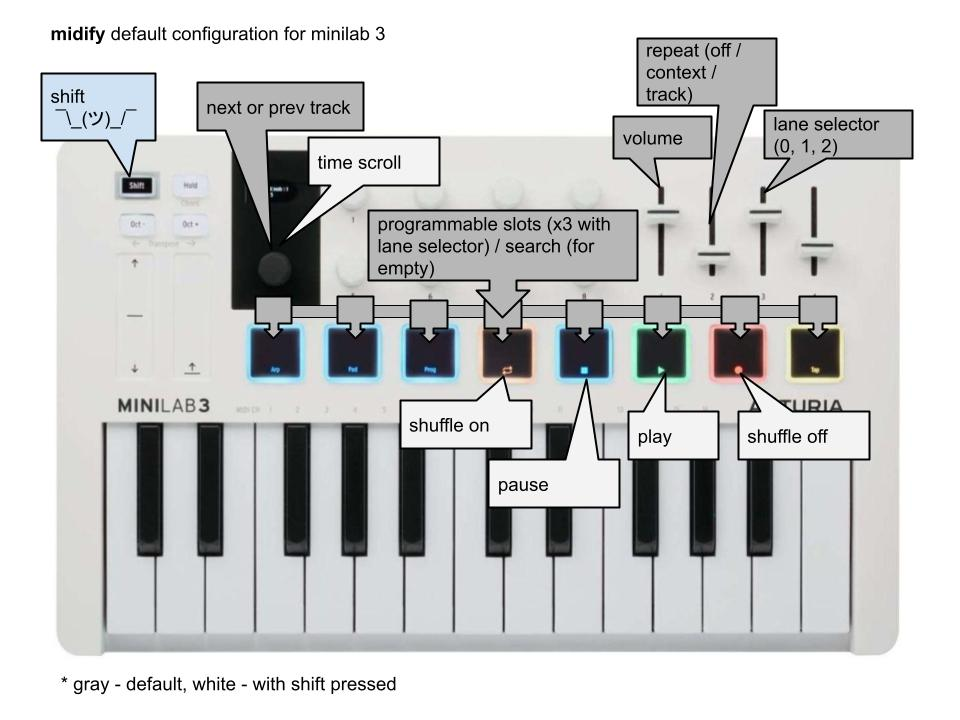

# Midify

## About <a name = "about"></a>

Scripts for controlling spotify via midi keybord (made for [minilab 3](https://www.arturia.com/products/hybrid-synths/minilab-3/overview)) or console.

### Prerequisites

python 3.7 is required for mido package.

## Getting Started <a name = "getting_started"></a>

1. Install all required python packages from [requirements.txt](./requirements.txt):

```
python3 -m pip install -r requirements.txt
```

2. Go to https://developer.spotify.com/ and create app.
3. Create ".env" file and put there app credentials. Example:

```
CLIENT_ID=<YOUR_CLIENT_ID>
CLIENT_SECRET=<YOUR_CLIENT_SECRET>
REDIRECT_URI=<YOUR_REDIRECT_URI>
```

4. Edit [config.json](./config.json) to fit your midi device (some functional may not be accessable for other devices).
5. Create [settings.json](./settings.json). Example:
``` 
{
    "(9, 36)": [
        "-t Skyrim - Dragonborn Theme",
        "-t Song of the Lonely Mountain",
        "-t Sing for Me - Lohse Version"
    ],
    "(9, 37)": [
        "-l DnD: Combat Standart",
        "-l DnD: Combat Tough",
        "-l DnD: Combat Epic"
    ],
    "(9, 38)": [
        "-l DnD: Location Tavern",
        "-l DnD: Location Town",
        "-l DnD: Location Capital"
    ],
    "(9, 39)": [
        "-l DnD: Travelling Road",
        "-l DnD: Travelling Wilderness",
        "-l DnD: Travelling Dungeon"
    ],
    "(9, 40)": [
        "-l DnD: Situation Tense",
        "-l DnD: Situation Stealth",
        "-l DnD: Situation Chase"
    ],
    "(9, 41)": [
        "-l DnD: Mood Sad",
        "-l DnD: Mood Joyful",
        "-l DnD: Mood Triumphant"
    ],
    "(9, 42)": [
        "-l DnD: Atmosphere Mystical",
        "-l DnD: Atmosphere Creepy",
        "-l DnD: Atmosphere Horrifying"
    ]
}
```

## Midify usage <a name = "usage"></a>

Default configuration:

Hold drumpad to reprogramm slot or modify [settings.json](./settings.json) dirrectly.

Command: \<flag/flags\> \<name\>

Flags:

- -l - local (saved) playlists
- -g - global search (default)
- -p - playlist
- -t - track (always global)
- -a - album (always global)
- --artist - artist (always global)

## Asfy usage <a name = "usage"></a>

Help function:

```
python3 asfy.py -h
```

Example:

```
python3 asfy.py -t="track" "torando of souls"
```
